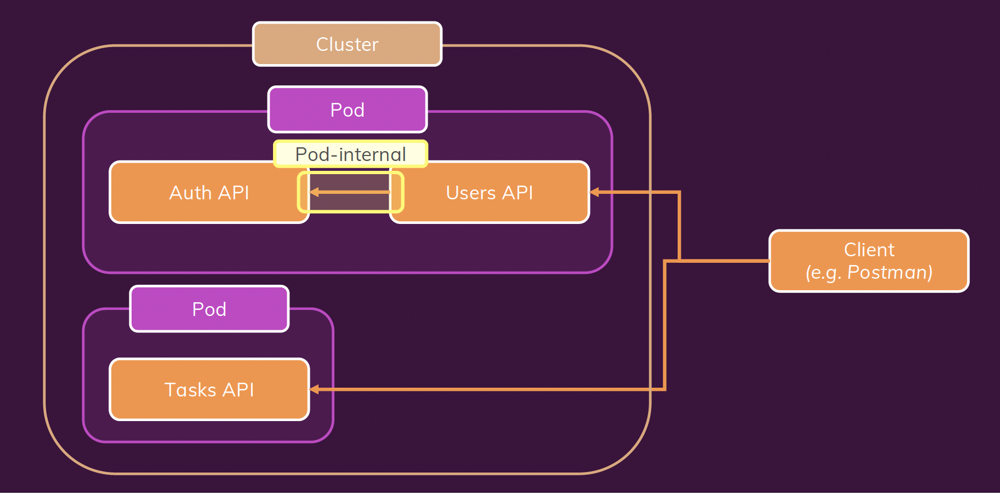

Please run the following commands to create all images and then kubernetes cluster

`docker build -t ashishyd/kub-users-api ./users-api`

`docker push ashishyd/kub-users-api`

`docker build -t ashishyd/kub-auth-api ./auth-api`

`docker push ashishyd/kub-auth-api`

`docker build -t ashishyd/kub-tasks-api ./tasks-api`

`docker push ashishyd/kub-tasks-api`

`docker build -t ashishyd/kub-frontend-app ./users-api`

`docker push ashishyd/kub-frontend-app`

`kubectl apply -f=./kubernetes/users-deployment.yaml -f=./kubernetes/users-service.yaml`

`kubectl apply -f=./kubernetes/auth-deployment.yaml -f=./kubernetes/auth-service.yaml`

`kubectl apply -f=./kubernetes/tasks-deployment.yaml -f=./kubernetes/tasks-service.yaml`

`kubectl apply -f=./kubernetes/frontend-deployment.yaml -f=./kubernetes/frontend-service.yaml`

For pod to pod communication you can utilize the environment variable provided by kubernetes `<SERVICE_NAME>_SERVICE_HOST` so user service can  talk to auth service using `AUTH_SERVICE_SERVICE_HOST`

To use reverse proxy add the front-end service ip address to `nginx.conf` file

```
location /api 
{
    proxy_pass http://<ip-address>:port;
}
```

but since the configuration run inside container ip address will not work properly so you should add pod to pod communication

```
location /api/ {
    proxy_pass http://tasks-service.default:8000;
}
```
## Architecture

